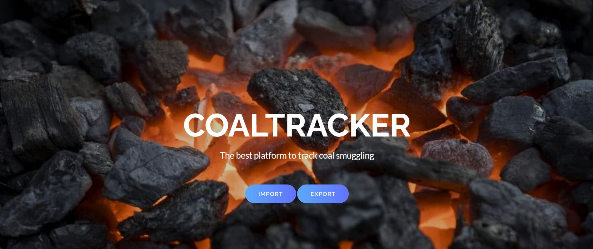

# 🔥🎫  CoalTracker  📃🔥

## 🥇The Blockchain based platform to track coal smuggling. 💰

### Survey

Recently, we may have heard or seen the news of Global Coal Crisis in the World.

https://www.cnbc.com/2021/10/12/coal-shortage-india-could-soon-be-on-the-brink-of-a-power-crisis.html

### Problem

Coal is the most beneficial mineral in this world. It is used in electricity generation.  And during, this crisis, there is a huge demand for coal, and supply is very reduced. So, the obvious thing is many fraudsters will try to do corruption, black marketing, and maybe smuggling of coal which is a big loss to the nation and econom. There is no proper platform for tracking coal import, export, and its verification at ports. There are various supply chain issues and we do not have exact track record of coal.

https://www.republicworld.com/tags/coal-smuggling-case

### Solution

CoalTracker has used Polygon Blockchain and Interplanetary File Storage to implement the solution. The advantages of my solution are fast QR code based verification, no legal tender to smuggled coal, catching smugglers and complete coal import/export tracking.

### Methodology

1) First, the exporter tries to export the coal by giving the details like production lot ID, quantity, source and destination country, exporting license and bill amount and generating a QR Code on these details.

2) This QR Code will printed on each production lot and will also be stored on IPFS Storage to prevent tampering in between routes.

3) Now, when the coal reaches importer, it will verify the printed QR code received with QR on IPFS Storage via camera. This is first step of verification. Now, it will enter details of coal received. These details will be compared with exporter' s details. If they are same then, importer approves coal for trade in country otherwise that coal will not be legal tender i.e no value so no point of trading unverified coal.

4) Now, consumer companies can get the authenticity of coal just by its production ID.

5) Hence, Only verified coal will be traded in market.

### Contract on Polygon Mumbai Testnet

[0x3F1eeB620D71E4263200E7Cd2B951ce02266b640](https://polygon-explorer-mumbai.chainstacklabs.com/address/0x3F1eeB620D71E4263200E7Cd2B951ce02266b640/transactions)

### Steps to Run

1) Clone this repository

2) Run 'npm install ' in main folder to install node modules.

3) Setup Metamask and truffle config according to your testnet.

4) Run 'npm start' in main folder and check landing page at http://localhost:3000

### Video Demo

